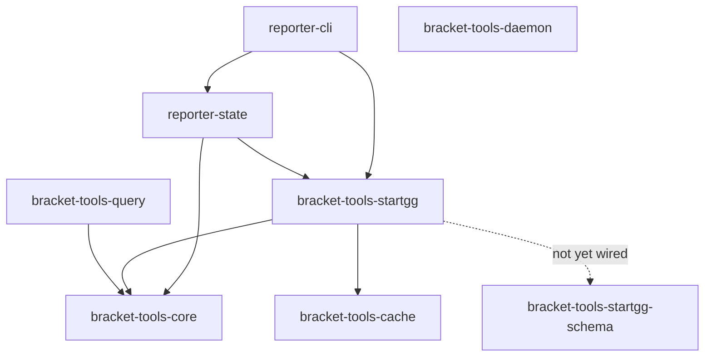

# bracket-tools Architecture

## Crate Dependency Graph



Dashed lines indicate planned but not yet wired dependencies.

## Crate Responsibilities

### bracket-tools-core

Normalized data types and traits shared across the workspace. Defines the
canonical representations of Tournament, Bracket, Set, Game, and Player. Leaf
crate with no internal dependencies.

### bracket-tools-cache

Generic sled-based disk caching layer. Exposes the `Provider` trait for
cache-aware data access and a GraphQL transport abstraction. Leaf crate with no
internal dependencies.

### bracket-tools-query

Abstract query interface designed for multi-platform support. Provides traits
that decouple consumer code from any single tournament platform. Depends on
bracket-tools-core for the normalized types that queries return.

### bracket-tools-startgg-schema

Cynic codegen types generated from the start.gg GraphQL schema. Leaf crate;
output is consumed by bracket-tools-startgg.

### bracket-tools-startgg

Main SDK crate. Implements a lazy-loading, caching, rate-limited client for the
start.gg API. Depends on bracket-tools-core (normalized types),
bracket-tools-cache (disk cache + provider trait), and will depend on
bracket-tools-startgg-schema once wiring is complete.

### reporter-cli

Ratatui-based TUI application for live set reporting. Depends on
bracket-tools-startgg (API access) and reporter-state (state management).

### reporter-state

State management layer for the reporter applications, built around a store
pattern. Depends on bracket-tools-core (data types) and bracket-tools-startgg
(API access).

### bracket-tools-daemon

Background scraper daemon for continuous data collection. Depends on serde and
sled directly; operates independently from the SDK crates.

## Data Flow

```
User code
    |
    v
StartggSdk
    |
    v
Cache check (sled)
    |
    +--[ hit ]---> Normalized types ---> User code
    |
    +--[ miss ]
         |
         v
    Rate-limited GraphQL request
         |
         v
    start.gg API
         |
         v
    Response
         |
         v
    Cache store (sled)
         |
         v
    Normalized types
         |
         v
    User code
```

1. User code calls into `StartggSdk` with a query.
2. The SDK checks the sled cache for a valid cached response.
3. On a cache hit, the cached data is deserialized into normalized core types
   and returned immediately.
4. On a cache miss, the SDK submits a rate-limited GraphQL request to the
   start.gg API.
5. The raw response is stored in the sled cache for future lookups.
6. The response is converted into normalized core types and returned to the
   caller.
